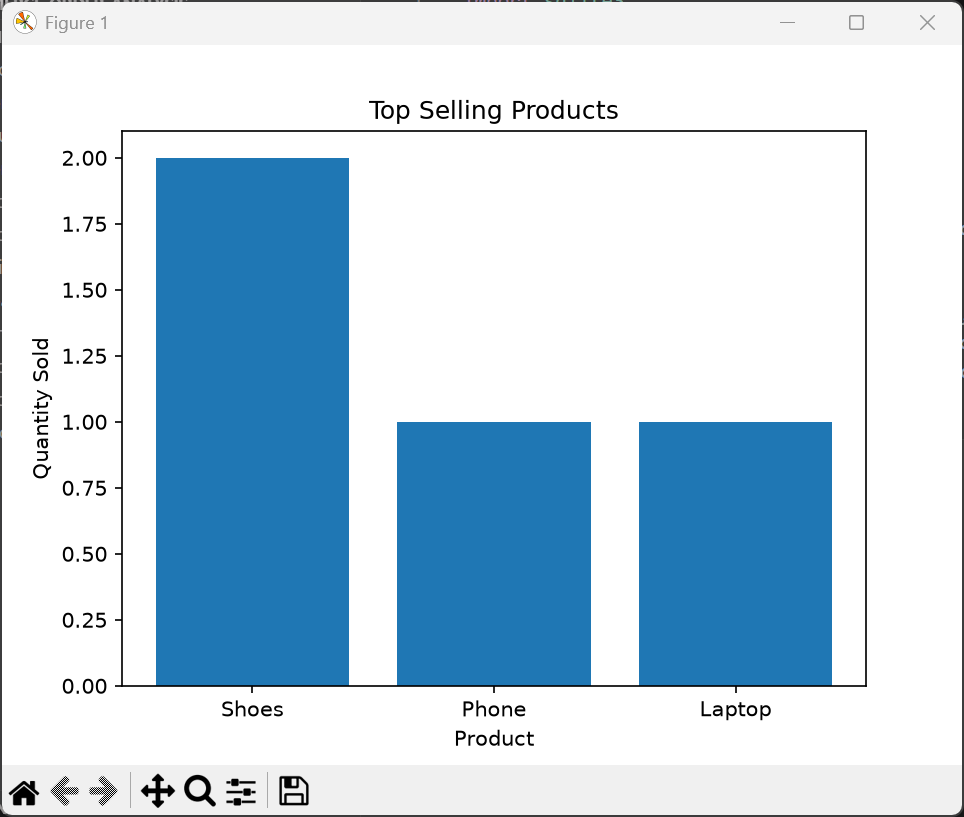
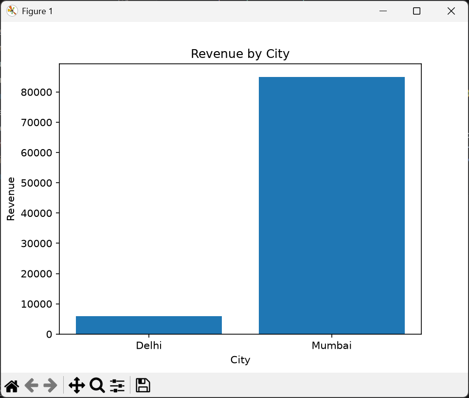
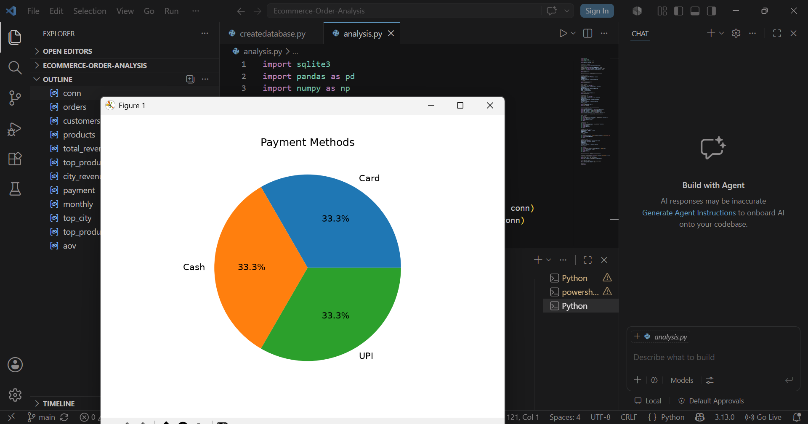

# 🛒 E-Commerce Order Analysis

## 📊 Project Overview
This project analyzes e-commerce sales data using Python, SQL, and data visualization techniques to extract meaningful business insights.

---

## 🚀 Features
- Total revenue calculation
- Top-selling products analysis
- Revenue by city
- Payment method distribution
- Monthly sales trends

---

## 🛠 Tech Stack
- Python
- Pandas
- NumPy
- SQLite
- Matplotlib

---

## 📈 Sample Insights
- Total Revenue: ₹91,000
- Top Product: Shoes
- Top City: Mumbai

---

## ▶️ How to Run

python createdatabase.py
python analysis.py

## 📷 Output Screenshots

### 📊 Top Products

### 📊 Revenue by City

### 📊 Payment Methods
![Payment]## 📷 Output Screenshots

### 📊 Top Products

### 📊 Revenue by City

### 📊 Payment Methods

## 📷 Output Screenshots

### 📊 Top Products

### 📊 Revenue by City

### 📊 Payment Methods

